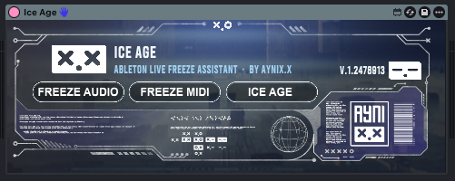

# ICE AGE - Ableton Live Freeze Assistant

**ICE AGE** is a one-click freeze assistant for Ableton Live, built as a Max for Live device by **Aynix.x**.

Freeze all audio tracks, all MIDI tracks, or the whole project with a single button. It is made for producers and collaborators tired of broken sessions, missing plugins, heavy CPU usage, and plugin version chaos.



## What it does

ICE AGE scans your Ableton Live Set, builds a freeze queue, and freezes eligible tracks one by one using Ableton Live's own Freeze command.

Main controls:

- **FREEZE AUDIO** - freezes eligible audio tracks.
- **FREEZE MIDI** - freezes eligible MIDI tracks.
- **ICE AGE** - freezes eligible audio and MIDI tracks.

## Smart skipping

ICE AGE automatically skips:

- the track containing the ICE AGE device, when detected
- tracks already frozen
- tracks Ableton cannot freeze
- tracks whose name contains `skip`

Example:

```text
sidechain trigger skip
```

That track will be ignored by ICE AGE. This is useful for sidechain triggers, routing tracks, reference tracks, or anything you want to keep active.

## How it works

Ableton Live does not expose a clean public per-track Freeze method to Max for Live. Because of that, ICE AGE uses a controlled workflow:

1. Scan the Live Set.
2. Temporarily unfold groups.
3. Build a filtered freeze queue.
4. Select each eligible track.
5. Send Ableton's Freeze shortcut.
6. Poll the track until it is frozen.
7. Move to the next track.
8. Auto-stop/reset when finished.

## Download / device files

For developer use, download the release package from the `DEVICE` folder and keep these files together:

```text
Ice_Age_by_Aynixx_v1.0.2.amxd
ice_age_core102.js
ice_age_helper02.js
```

Do **not** rename the JavaScript files in the device folder. The Max for Live device points to those exact filenames.

## Requirements

- Ableton Live with Max for Live.
- Tested primarily on Windows with Ableton Live 12.
- macOS support uses AppleScript/System Events and may require Accessibility / Automation permissions.

## Focus behavior

On Windows, if Ableton Live is already focused works clean. If another window is focused, it brings Ableton Live forward and clicks only the top/title area before sending the Freeze shortcut.

macOS may require permissions in:

```text
System Settings -> Privacy & Security -> Accessibility
System Settings -> Privacy & Security -> Automation
```

You may need to allow Ableton Live, Max, System Events, or `osascript` depending on your setup.

## Known limitations

- Freeze is triggered through Ableton's keyboard shortcut system.
- Manual freeze cancellation is detected by timeout, not instantly.
- The device should be placed on an empty utility/MIDI track when possible.

## Repository structure

```text
device/   Editable Max patch and JS source files + Final device files for Ableton users.
assets/   Preview images, UI images, logos, and references.
```

## Credits

Created by **Aynix.x**.

## License

Released under **CC BY-NC-ND 4.0** unless otherwise stated. See `LICENSE.md`.
